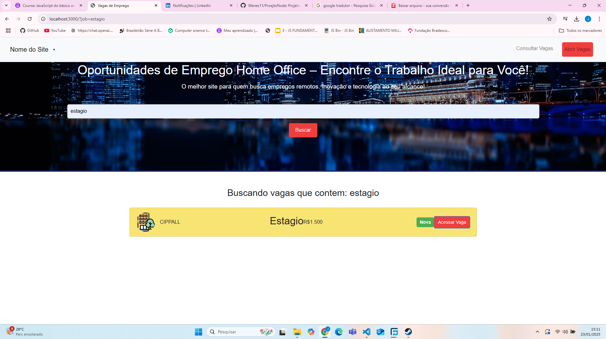
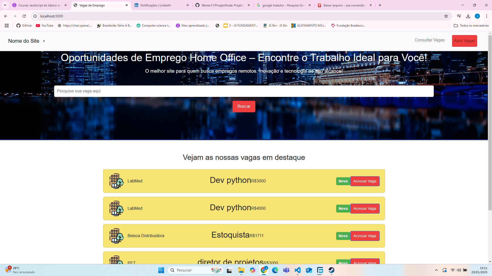

# 💼 Projeto: Plataforma de Vagas de Emprego com Node.js

Este projeto é uma aplicação web desenvolvida com **Node.js**, utilizando **Express**, **Handlebars** e **SQLite**, com testes de rotas realizados via **Postman**. Seu objetivo é ajudar usuários a encontrarem e se candidatarem a vagas de emprego.

## 🚀 Funcionalidades

- 🔎 Busca de vagas por palavras-chave
- 📝 Cadastro de novas vagas
- 👤 Candidatura simples via formulário
- 📄 Visualização de vagas em destaque
- 💾 Armazenamento em banco de dados SQLite

## 🛠 Tecnologias Utilizadas

- [Node.js](https://nodejs.org/)
- [Express](https://expressjs.com/)
- [Handlebars](https://handlebarsjs.com/)
- [SQLite3](https://www.sqlite.org/index.html)
- [Postman](https://www.postman.com/)

## 🖼️ Demonstrações Visuais

### 🔍 Tela de busca de vagas


### ⭐ Vagas em destaque


### 📋 Visual geral da aplicação


## 🧪 Como Testar

1. Clone o repositório:
   ```bash
   git clone https://github.com/seu-usuario/seu-repo.git
   cd seu-repo
